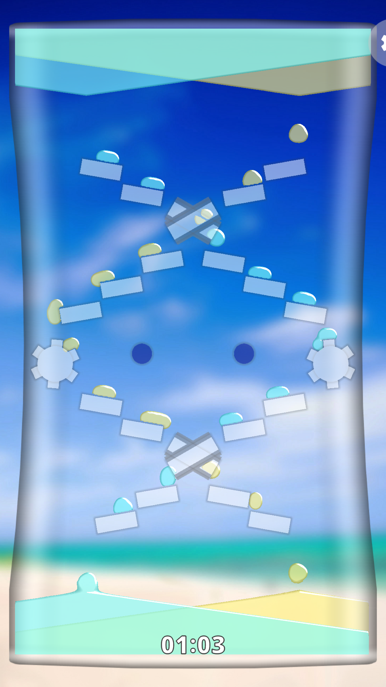
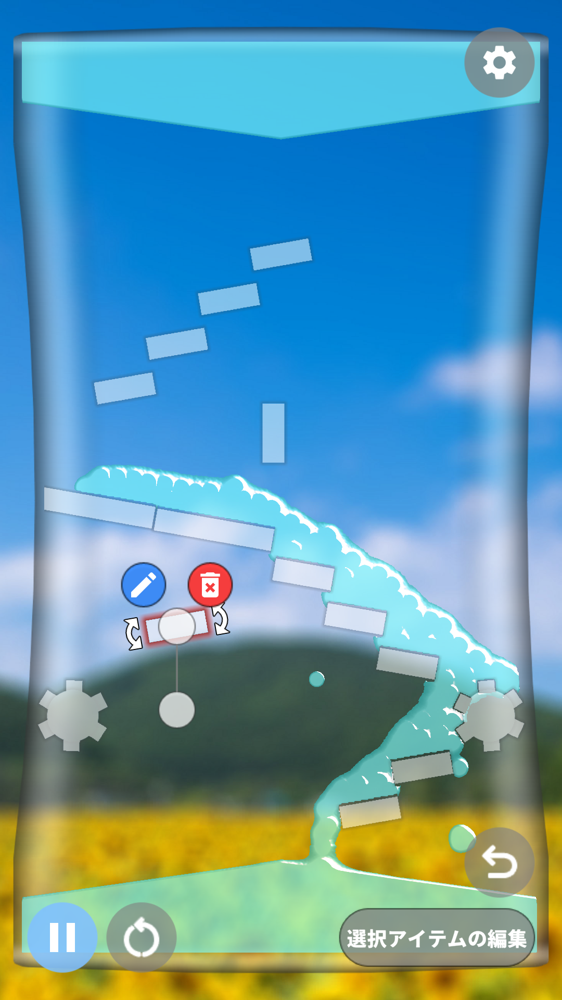
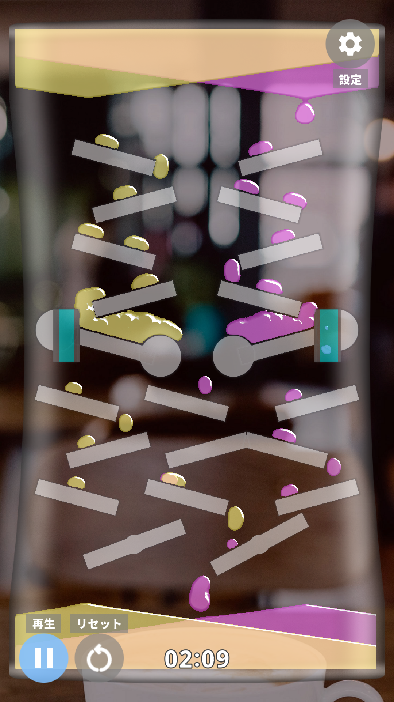

# Oil Timer Simulator

A simulator of oil timer made with Unity. Edit mode included.  
JP: Unity で作ったオイルタイマーのシミュレーターです。エディットモードも実装。

## License

This project is licensed under the MIT License - see the [LICENSE](LICENSE) file for details.